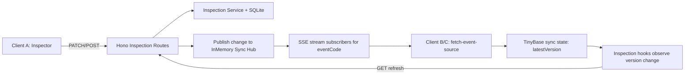
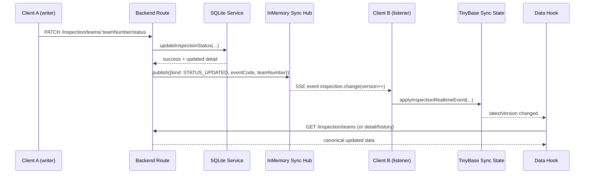
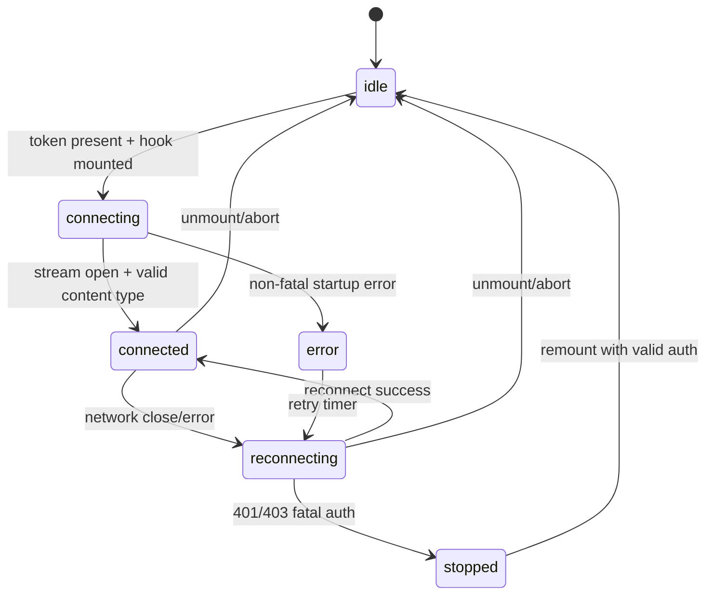

# Realtime Sync Architecture (Inspection Foundation)

## Purpose
This document describes the implemented realtime sync foundation for inspection, and defines the pattern to reuse for future features (for example, scoring).

It is implementation-aligned with current code:
- Backend stream and publishing: `src/bun/server/api/inspection/inspection.routes.ts`
- Backend sync hub: `src/bun/server/api/inspection/inspection-sync.ts`
- Frontend SSE client: `src/mainview/features/inspection/services/inspection-sync-service.ts`
- Frontend TinyBase sync state: `src/mainview/features/inspection/state/inspection-sync-store.ts`
- Frontend hooks integration:
  - `src/mainview/features/inspection/hooks/use-inspection-realtime.ts`
  - `src/mainview/features/inspection/hooks/use-inspection-realtime-version.ts`
  - `src/mainview/features/inspection/hooks/use-inspection-teams.ts`
  - `src/mainview/features/inspection/hooks/use-inspection-detail.ts`

---

## 1. Scope and Non-Goals

### In Scope
- Event-scoped server push notification channel for inspection updates.
- Automatic client refresh after another user changes inspection data.
- Reusable architecture pattern for future event features.

### Out of Scope (Current Implementation)
- Cross-process / multi-server message fanout.
- Durable event replay from server history.
- CRDT conflict resolution on client.
- Full row-level push payloads over stream.

---

## 2. Core Design Decisions

1. Server-Sent Events (SSE) for one-way server-to-client notifications.
2. Server-authoritative data model:
- Writes go to normal REST routes.
- SSE only sends lightweight change notifications.
- Clients re-fetch canonical data via REST.
3. TinyBase is used as reactive sync state, not as authoritative business storage.
4. Event-scoped channels (`eventCode`) prevent cross-event update leakage.
5. Event payloads are minimal to reduce complexity and bandwidth.

---

## 3. Architecture Overview



Key point: stream events are "poke" events, not full data sync payloads.

---

## 4. Backend Design

## 4.1 Sync Hub (Publisher-Subscriber)
File: `src/bun/server/api/inspection/inspection-sync.ts`

Responsibilities:
- Hold subscribers per `eventCode`.
- Keep monotonic in-memory version counter per `eventCode`.
- Publish typed events to current subscribers.
- Provide initial snapshot hint event with current version.

Main types:
- `InspectionSyncChangeKind`
- `InspectionSyncEvent`
- `InspectionSyncPublisher`

Current event kinds:
- `ITEMS_UPDATED`
- `STATUS_UPDATED`
- `COMMENT_UPDATED`
- `OVERRIDE_APPLIED`
- `SNAPSHOT_HINT` (stream initialization hint)

## 4.2 SSE Stream Endpoint
File: `src/bun/server/api/inspection/inspection.routes.ts`

Route:
- `GET /api/events/:eventCode/inspection/stream`

Auth and authorization:
- `requireAuth` middleware (JWT bearer token).
- `requireInspector` role guard.

Stream behavior:
- Uses `streamSSE(...)` from Hono.
- Sends an initial `SNAPSHOT_HINT`.
- Sends event `inspection.change` with JSON payload.
- Sends heartbeat comments every 20 seconds.
- Sets `retry: 2000` for client reconnect suggestion.
- Unsubscribes and clears heartbeat on abort/disconnect.

## 4.3 Publish Points (Write Routes)
File: `src/bun/server/api/inspection/inspection.routes.ts`

Publisher is invoked immediately after successful mutations:
- `PATCH .../items` -> `ITEMS_UPDATED`
- `PATCH .../status` -> `STATUS_UPDATED`
- `POST .../comment` -> `COMMENT_UPDATED`
- `POST .../override` -> `OVERRIDE_APPLIED`

This keeps business logic (`inspection.service.ts`) focused on domain/data concerns and leaves sync orchestration in routes.

---

## 5. Event Contract

Event name:
- `inspection.change`

SSE fields:
- `event`: `inspection.change`
- `id`: `<eventCode>:<version>`
- `retry`: `2000`
- `data`: JSON payload below

Payload:

```json
{
  "changedAt": "2026-02-22T15:00:00.000Z",
  "eventCode": "S4V1",
  "kind": "STATUS_UPDATED",
  "teamNumber": 12345,
  "version": 42
}
```

Rules:
- `version` is monotonically increasing per `eventCode` while process is running.
- `teamNumber` is `null` for non-team-specific events (`SNAPSHOT_HINT`).
- Payload is notification metadata only; clients must re-fetch data.

---

## 6. Frontend Design

## 6.1 Realtime Transport Service
File: `src/mainview/features/inspection/services/inspection-sync-service.ts`

Responsibilities:
- Open authenticated SSE using `@microsoft/fetch-event-source`.
- Validate response content type and payload shape.
- Handle reconnects (default retry path).
- Treat `401/403` as fatal (stop reconnect).
- Emit parsed events and connection state updates to caller.

Why `fetch-event-source`:
- Supports custom headers (`Authorization`).
- Better control than native `EventSource` for authenticated streams.

## 6.2 TinyBase Sync State Store
File: `src/mainview/features/inspection/state/inspection-sync-store.ts`

Responsibilities:
- Keep minimal sync metadata keyed by `eventCode`.
- Expose read/write helpers and version subscriptions.

Stored fields per event:
- `connectionState`
- `lastError`
- `lastEventAt`
- `lastEventId`
- `latestVersion`

## 6.3 Realtime Lifecycle Hook
File: `src/mainview/features/inspection/hooks/use-inspection-realtime.ts`

Responsibilities:
- Start/stop stream lifecycle for an `eventCode` + token.
- Apply stream events to TinyBase.
- Update connection state and error state.
- Abort cleanly on unmount/navigation.

## 6.4 Data Hooks Auto-Refresh
Files:
- `src/mainview/features/inspection/hooks/use-inspection-teams.ts`
- `src/mainview/features/inspection/hooks/use-inspection-detail.ts`

Behavior:
- Observe `latestVersion` from TinyBase.
- On version increase, trigger debounced re-fetch (~250ms).
- Continue using existing REST data fetch functions.

Why this model:
- Preserves existing business/data APIs.
- Avoids dual-write complexity in client state.
- Easy to apply to additional features.

---

## 7. Sequence Diagram



---

## 8. Connection State Model



---

## 9. Design Patterns Used

1. Publisher-Subscriber (Observer)
- Hub dispatches events to subscribers by `eventCode`.
- Clients subscribe once and react to change notifications.

2. Server-Authoritative Cache Refresh
- Notification channel does not carry full domain data.
- Client re-fetches server truth on change.

3. Event Envelope Pattern
- Stable envelope fields: `eventCode`, `kind`, `version`, `changedAt`, `teamNumber`.
- Domain logic can evolve behind a stable notification contract.

4. Separation of Concerns
- Domain writes remain in inspection service/routes.
- Realtime transport isolated in sync service/hub modules.
- UI data hooks remain focused on fetching and rendering.

5. Graceful Degradation
- If stream drops, reconnect attempts continue.
- If stream unavailable, manual refresh and existing APIs still work.

---

## 10. Current Limitations and Operational Notes

1. In-memory hub only:
- Restart resets counters and subscriber list.
- Works well for single-server LAN deployment.

2. No durable replay:
- Clients that were offline only catch up after next event triggers re-fetch.
- Initial `SNAPSHOT_HINT` helps align version on connect, but does not replay history.

3. Per-page stream mount:
- Each inspection page mounts its own stream hook.
- This is acceptable for current usage and concurrency target.

4. Security:
- Authorization token is sent in header (not query string).
- Stream access is role-gated with the same inspection permissions.

5. Performance expectation:
- 50 LAN clients with lightweight events is within normal SSE capacity for this topology.

---

## 11. Future Feature Blueprint (Scoring and Beyond)

Use this checklist to add realtime to a new feature domain:

1. Define feature event contract
- Event name: `<feature>.change` (example: `scoring.change`)
- Kinds: explicit domain actions (example: `AUTO_SAVED`, `TELEOP_SAVED`, `FINALIZED`)
- Payload envelope mirrors inspection pattern.

2. Add backend sync module
- File: `src/bun/server/api/<feature>/<feature>-sync.ts`
- Keep publisher interface + in-memory implementation.

3. Add feature stream route
- Route: `/api/events/:eventCode/<feature>/stream`
- Reuse auth + role guards.
- Send `SNAPSHOT_HINT`, heartbeat, retry.

4. Publish only after successful writes
- Keep publish calls in routes after DB commits.

5. Add frontend transport service + TinyBase state
- File: `src/mainview/features/<feature>/services/<feature>-sync-service.ts`
- File: `src/mainview/features/<feature>/state/<feature>-sync-store.ts`

6. Add hook integration
- `use<Feature>Realtime(...)` for lifecycle.
- `use<Feature>RealtimeVersion(...)` for subscriptions.
- Existing data hooks refresh on version changes.

7. Keep payloads minimal
- Send identifiers and version only.
- Fetch authoritative data via existing REST endpoints.

8. Add observability
- Count stream connects/disconnects.
- Count publish events by kind.
- Track refresh latency from publish to refetch complete.

---

## 12. Scale Path (When Needed)

If deployment moves beyond single process:

1. Replace in-memory hub backend
- Option A: Redis pub/sub (simple fanout).
- Option B: Durable event log table with last-seen cursor.

2. Preserve API contract
- Keep `inspection.change` payload and endpoint shape stable.
- Clients should not need changes when backend transport changes.

3. Optional evolution to WebSocket
- Consider WebSocket only if bidirectional low-latency updates become required.
- Keep "server-authoritative + refetch" semantics unless requirements change.

---

## 13. Testing Checklist

## Manual acceptance tests
1. Open at least 3 clients on same event inspection pages.
2. Update item/status/comment/override in client A.
3. Verify client B/C refresh within target delay (0.5-1.0s typical LAN).
4. Disconnect client network briefly and reconnect.
5. Verify stream recovers and next change refreshes data.
6. Verify unauthorized token cannot keep stream open.

## Backend validation
1. Confirm stream endpoint requires auth and inspector role.
2. Confirm each write route publishes exactly one correct `kind`.
3. Confirm heartbeat and cleanup happen on disconnect.

## Frontend validation
1. Confirm TinyBase `latestVersion` increments only monotonically.
2. Confirm hooks debounce and avoid burst refetch storms.
3. Confirm fatal auth errors stop retry loop.

---

## 14. Quick API Reference

### Stream
- `GET /api/events/:eventCode/inspection/stream`
- Headers: `Authorization: Bearer <token>`
- Content-Type: `text/event-stream`

### Existing write endpoints that trigger sync
- `PATCH /api/events/:eventCode/inspection/teams/:teamNumber/items`
- `PATCH /api/events/:eventCode/inspection/teams/:teamNumber/status`
- `POST /api/events/:eventCode/inspection/teams/:teamNumber/comment`
- `POST /api/events/:eventCode/inspection/teams/:teamNumber/override`

### Existing read endpoints used for refresh
- `GET /api/events/:eventCode/inspection/teams`
- `GET /api/events/:eventCode/inspection/teams/:teamNumber`
- `GET /api/events/:eventCode/inspection/teams/:teamNumber/history`

---

## 15. Summary
The implemented inspection sync architecture is a low-complexity, high-pragmatism foundation:
- SSE for change notification.
- REST for canonical reads/writes.
- TinyBase for reactive version-driven refresh.

It is intentionally simple for LAN single-node deployment, and structured so future features can reuse the same pattern with minimal risk and predictable behavior.
