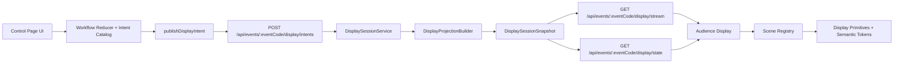

# Display Control Workflow Implementation Plan

**Date**: 2026-03-11
**Type**: Feature Implementation + Refactor
**Status**: In Progress - Phase 1 Ready
**Scope**: Display workflow, shared command contract, audience display scenes, design system, control page cleanup
**Context Tokens**: Current implementation covers 9 of 17 documented display modes. `Show Preview` and `Show Match` are mapped to the wrong scene ids. The display contract is duplicated across server and client, the control page owns too much workflow state, and the audience display guesses match context from admin data instead of receiving an authoritative display session snapshot.

## Executive Summary

This work is not only "add 8 screens". It is a subsystem cleanup that must fix the control workflow, remove type drift, make the display render the correct match reliably, and introduce a small display design system so new scenes do not keep expanding one large page component and one large CSS file.

The implementation should move from the current model of sending thin mode commands and letting the display infer the rest, to a cleaner model where the server owns the display session state and publishes typed snapshots. That gives better code quality, cleaner responsibilities, safer public display data, and a scalable way to finish all 17 display modes.

## Context Links

- **Primary spec**: `docs/display-control-workflow.md`
- **Related research**: `docs/display-control.md`
- **Realtime pattern reference**: `docs/realtime-sync-architecture.md`
- **Match control context**: `docs/match-control.md`
- **Current plan file**: `plans/260311-0756-display-control-workflow-implementation/plan.md`
- **Core implementation**:
  - `src/mainview/pages/events/control/event-control-page.tsx`
  - `src/mainview/features/display/display-command-channel.ts`
  - `src/mainview/features/display/use-display-command.ts`
  - `src/mainview/features/display/use-display-data.ts`
  - `src/mainview/features/display/display-scene-renderer.tsx`
  - `src/bun/server/api/display/display.routes.ts`
  - `src/bun/server/api/display/display.schema.ts`
  - `src/bun/server/api/display/display-sync.ts`

## Current State Analysis

### Verified Product Gaps

- `Show Preview` currently sends `match-preview`, but the workflow spec says it should show the `next-match` screen.
- `Show Match` currently sends `match-start` without `startedAtMs`, but the workflow spec says it should show the `match-preview` screen.
- Only 9 of 17 documented display modes exist in code.
- Several "implemented" scenes are still partial:
  - `next-match` currently shows only a countdown, not the full "Up Next" match payload.
  - `match-preview` currently looks like a simple matchup card, not the documented frozen 2:30 match view.
  - `sponsors` is still placeholder content.

### Verified Architecture Gaps

- The display does not receive authoritative match context. It guesses the loaded match from the first row where `state !== "COMMITTED"`.
- The display command contract is duplicated in multiple places:
  - `src/mainview/features/display/display-scene-types.ts`
  - `src/mainview/features/display/display-command-channel.ts`
  - `src/bun/server/api/display/display.schema.ts`
  - `src/bun/server/api/display/display-sync.ts`
- The public audience display depends on admin-oriented data fetching in `use-display-data.ts`.
- The control page keeps workflow state only in `event-control-page.tsx`, so that state is not reusable, not authoritative, and hard to test.
- Scene rendering is a large switch statement that will keep growing as more modes are added.

### Current Code Quality Risks

| File | Current Size | Risk |
|------|--------------|------|
| `src/mainview/pages/events/control/event-control-page.tsx` | 904 lines | Mixed UI, workflow, timers, settings persistence, display actions |
| `src/mainview/features/display/use-display-data.ts` | 306 lines | Broad data orchestration + mapping + polling in one hook |
| `src/mainview/app/styles/components/display.css` | 469 lines | Base styles, scene styles, and layout styles packed together |
| `src/mainview/features/display/display-command-channel.ts` | 178 lines | Transport concerns mixed with command shaping |

### Existing Strengths To Preserve

- POST write route already has auth and event-admin protection.
- Same-browser updates are fast because BroadcastChannel and localStorage run in parallel with SSE publishing.
- `tokens.css` already provides a usable base token system.
- The inspection realtime document already shows the repo's preferred SSE pattern: server-authoritative data with clients re-fetching or reconciling from canonical state.

## Goals

### Functional Goals

- Fix the match lifecycle mapping so control actions show the correct audience screens.
- Implement all 17 documented display modes.
- Make the audience display render the correct loaded or active match even when the operator chooses a non-default match.
- Keep same-device instant updates and cross-device realtime updates.

### Code Quality Goals

- Create one shared source of truth for display scene ids, command schemas, snapshot schemas, and SSE payload schemas.
- Move workflow transitions into pure, testable logic instead of keeping them embedded in one page component.
- Replace hard-coded display button lists and switch statements with declarative registries.
- Keep new modules under about 200 lines when practical and materially shrink the oversized files above.
- Split display styling into reusable primitives and scene-specific files.

### Design System Goals

- Reuse existing global tokens from `tokens.css`.
- Add display-specific semantic tokens instead of scene-specific one-off colors.
- Create a small set of display primitives that every scene composes from.
- Standardize typography, spacing, tables, alliance colors, timer treatment, empty states, and footer/header chrome.

### Non-Goals

- No multi-process or durable cross-server sync in this phase.
- No new global state library for the frontend.
- No fake data or placeholder sample content to "complete" a scene.
- No broad redesign of unrelated control tabs outside the display workflow.

## Target Architecture

### Core Decision

Use a **server-authoritative display session**. The control page should send intents. The server should translate those intents into a typed display session snapshot. The audience display should render from that snapshot, not infer match context from unrelated admin pages.

### High-Level Flow



### Architecture Rules

- The server owns `scene`, `workflowStep`, `loadedMatchRef`, `activeMatchRef`, `startedAtMs`, `message`, and any scene payload needed to render correctly.
- The control page owns only transient UI state and local button affordances.
- The audience display consumes public-safe snapshots or public-safe scene projections only.
- The transport layer must not be the source of truth for workflow decisions.
- Scene components must be presentational and receive typed view models.

### Proposed Module Boundaries

| Module | Responsibility |
|--------|----------------|
| `src/shared/display/` | Shared scene ids, Valibot schemas, TypeScript types, helpers |
| `src/bun/server/api/display/display-session-service.ts` | Per-event display session state and transitions |
| `src/bun/server/api/display/display-projection-service.ts` | Build public-safe scene payloads from event data |
| `src/bun/server/api/display/display.routes.ts` | Thin HTTP routes for intents, snapshot reads, and SSE |
| `src/mainview/pages/events/control/use-event-display-workflow.ts` | Pure reducer/hook for button state and local orchestration |
| `src/mainview/features/display/display-scene-registry.tsx` | Declarative map from scene id to component + metadata |
| `src/mainview/features/display/use-display-session.ts` | Subscribe to snapshots and expose display session state |
| `src/mainview/features/display/primitives/` | Shared scene building blocks |
| `src/mainview/app/styles/components/display-*.css` | Split display styles into base, primitives, and scene files |

## Data Contract Design

### Shared Contract

Create a shared contract module that exports:

- `displaySceneIdSchema`
- `displayIntentSchema`
- `displaySessionSnapshotSchema`
- `displayStreamEventSchema`
- `DisplaySceneId`
- `DisplayIntent`
- `DisplaySessionSnapshot`

Use Valibot as the single schema authority and derive TypeScript types from it.

### Snapshot Shape

The snapshot should include enough information for the display to render without guessing:

- `eventCode`
- `version`
- `scene`
- `workflowStep`
- `message`
- `loadedMatch`
- `activeMatch`
- `startedAtMs`
- `rankingsSummary`
- `inspectionSummary`
- `scenePayload`
- `updatedAt`

`scenePayload` should be a discriminated payload keyed by `scene` so each scene receives only the shape it needs.

### Transport Strategy

- Keep BroadcastChannel/localStorage as an optional same-browser speed path.
- Reconcile the display UI against the server snapshot as the final source of truth.
- Prefer SSE events that contain either the full snapshot or a versioned snapshot envelope, not only `{ mode, message, startedAtMs }`.

## Design System Direction

### Semantic Tokens

Add display-scoped tokens on top of existing global tokens:

- `--display-bg`
- `--display-surface`
- `--display-surface-strong`
- `--display-border`
- `--display-text`
- `--display-muted`
- `--display-red`
- `--display-blue`
- `--display-success`
- `--display-warning`
- `--display-timer-bg`

These should map back to the global token set instead of introducing unrelated new colors.

### Reusable Display Primitives

Create a small primitive set and build every scene from it:

- `DisplayShell`
- `DisplayHeader`
- `DisplayFooter`
- `DisplayHeroPanel`
- `DisplayAllianceCard`
- `DisplayScoreBar`
- `DisplayMetricTable`
- `DisplayStatusPill`
- `DisplayEmptyState`

### CSS Organization

Split `display.css` into focused files:

- `display-base.css`
- `display-layout.css`
- `display-primitives.css`
- `display-match-scenes.css`
- `display-table-scenes.css`
- `display-info-scenes.css`

### Visual Consistency Rules

- All numeric values use tabular figures.
- Match scenes share one alliance-card treatment and one score-bar treatment.
- Table scenes share one table density, header style, and footer style.
- Empty states must be deliberate, production-safe, and clearly say when real event data is unavailable.
- The gear button must either be wired to real display options or removed from scenes where it is decorative only.

## Scene Inventory And Delivery Order

| Category | Scenes | Current State | Data Dependency | Delivery Priority |
|----------|--------|---------------|-----------------|------------------|
| Match lifecycle | `next-match`, `match-preview`, `match-start`, `match-winner` | Present but not fully spec-aligned | Loaded/active match snapshot, timer, scores | P1 |
| Utility | `blank`, `text-notification` | Present | None or simple message payload | P1 |
| Event info | `wifi-reminder`, `audience-key`, `safety-security`, `online-results-info` | Missing | Public config or simple content payload | P2 |
| Content | `sponsors`, `slideshow`, `video-overlay` | `sponsors` partial, others missing | Sponsor/media/public asset source | P2 |
| Tables and competition views | `ranking-result`, `robot-inspection-status`, `bracket`, `alliance-selection` | 2 present, 2 missing | Public rankings, inspection, playoff, alliance data | P3 |

## Implementation Phases

### Phase 1: Fix The Critical Workflow Mapping
**Estimate**: 0.5 day

**Scope**

- Correct the user-facing match lifecycle behavior before any structural expansion.

**Tasks**

1. Change `Show Preview` to publish `next-match`.
2. Change `Show Match` to publish `match-preview`.
3. Add a pure mapping helper so the action-to-scene mapping is no longer hard-coded inline.
4. Add a regression check for the mapping logic.

**Phase 01 Sub-Plan**

1. Inventory every current publish path for `Show Preview` and `Show Match` in the control page so the fix covers action handlers, helper wrappers, and any same-browser fast path code.
2. Extract one small mapping helper in `src/mainview/pages/events/control/` that translates control actions to scene ids and leaves room for later migration to the shared display contract in Phase 2.
3. Replace inline scene strings in `event-control-page.tsx` with the helper and verify the rest of the button enablement logic does not change.
4. Add one focused regression check for the mapping helper instead of testing the full page component.
5. Run a quick manual control-flow verification: load match -> show preview -> show match and confirm the emitted scene ids are `next-match` then `match-preview`.

**Files**

- `src/mainview/pages/events/control/event-control-page.tsx`
- `src/mainview/pages/events/control/` for the extracted mapping helper

**Acceptance Criteria**

- `Show Preview` shows the Next Match scene.
- `Show Match` shows the Match Preview scene.
- No remaining inline string duplication for those control actions.

**Dependencies And Risks**

- Keep the extracted helper small and scene-id only. Do not pull shared schema work into this phase.
- Check for hidden duplication outside the main action bar so the bug is not fixed in only one code path.

**Verification**

- Focused automated check for the action-to-scene mapping.
- Manual smoke test of the match lifecycle buttons on the control page.

### Phase 2: Centralize The Display Contract
**Estimate**: 1 day

**Scope**

- Eliminate scene-id and schema drift across client and server.

**Tasks**

1. Create a shared display contract module under `src/shared/display/`.
2. Define the full 17-scene id set once.
3. Define Valibot schemas for intents, snapshots, and stream envelopes.
4. Replace duplicated unions in current server and client modules.
5. Add compile-time and runtime validation at route boundaries.

**Phase 02 Sub-Plan**

1. Audit all current display contract definitions and group them into three buckets: scene ids, transport payloads, and client-only derived helpers.
2. Create a small shared module layout under `src/shared/display/` for scene ids, schema definitions, exported types, and package-level re-exports.
3. Define the full 17-scene id set first, then layer intent and stream envelope schemas on top so every downstream file migrates to a stable base.
4. Add the first version of `displaySessionSnapshotSchema` with only the fields already known in this plan, leaving scene-specific payload growth for Phase 3.
5. Migrate server files to import schema-backed types from the shared module and validate request and stream payloads at the route/sync boundaries.
6. Migrate client display command modules to the same shared exports and delete local scene-id unions that become redundant.
7. Finish with a compile pass and a grep pass to confirm no stale manual unions or duplicate scene literals remain outside the shared contract.

**Files**

- `src/shared/display/`
- `src/bun/server/api/display/display.schema.ts`
- `src/bun/server/api/display/display-sync.ts`
- `src/mainview/features/display/display-scene-types.ts`
- `src/mainview/features/display/display-command-channel.ts`

**Acceptance Criteria**

- Scene ids exist in one place only.
- Server and client import the same schema-backed types.
- The codebase supports all 17 scene ids without manual union drift.

**Dependencies And Risks**

- Watch for cross-runtime import issues between shared code, Bun server code, and `mainview` code. The shared module must stay dependency-light.
- Avoid over-designing the snapshot schema before Phase 3 finalizes the authoritative session model.
- If any existing local helper needs a client-only type, derive it from the shared schema exports instead of recreating a parallel union.

**Verification**

- Build/typecheck after each migration step instead of doing one large contract swap at the end.
- Grep validation for duplicate scene-id unions and stale schema definitions in display modules.

### Phase 3: Introduce Server-Authoritative Display Session State
**Estimate**: 1.5 days

**Scope**

- Stop making the display infer loaded match state from admin data.

**Tasks**

1. Create `DisplaySessionService` for per-event display state.
2. Add intent handlers such as `loadMatch`, `showPreview`, `showMatch`, `startMatch`, `showWinner`, `showRanks`, `showMessage`.
3. Publish a typed snapshot after every accepted intent.
4. Add `GET /api/events/:eventCode/display/state`.
5. Update SSE publishing to emit the canonical snapshot envelope.
6. Include real match references in the snapshot so non-default loaded matches display correctly.

**Phase 03 Sub-Plan**

1. Define the in-memory session model first: per-event state shape, versioning rules, lifecycle timestamps, and how `loadedMatch` differs from `activeMatch`.
2. Implement `DisplaySessionService` as the only place that accepts display intents and returns the next canonical snapshot.
3. Add a projection layer that resolves public-safe match, rankings, and inspection context into the snapshot without reusing admin-oriented client fetch assumptions.
4. Update the POST intent route to call the session service, persist the accepted transition in memory, and publish the resulting typed snapshot envelope.
5. Add `GET /api/events/:eventCode/display/state` so a display refresh can bootstrap from canonical state before the SSE stream catches up.
6. Update `display-sync.ts` to publish versioned snapshot events and keep the existing same-process SSE pattern aligned with the inspection architecture document.
7. Add the minimal display-page consumer changes needed to restore from the snapshot endpoint and stop guessing the current match from admin data.
8. Verify the non-default match path explicitly: load a specific match, publish preview/match/winner states, refresh the display page, and confirm the same match remains selected.

**Files**

- `src/bun/server/api/display/display.routes.ts`
- `src/bun/server/api/display/display-sync.ts`
- `src/bun/server/api/display/display-session-service.ts`
- `src/bun/server/api/display/display-projection-service.ts`

**Acceptance Criteria**

- The display does not guess the loaded or active match anymore.
- `Commit & Post` can publish winner state with real match context.
- A refresh on the display page restores the current display session from the snapshot endpoint.

**Dependencies And Risks**

- Snapshot payloads must stay public-safe. Do not leak admin-only fields just because the server now owns more state.
- Clarify how match timer fields such as `startedAtMs` are represented before wiring live match scenes to the new session snapshot.
- Keep the session service isolated from HTTP and SSE details so it remains testable and reusable by later control-page refactors.

**Verification**

- Service-level tests for intent transitions and snapshot version increments.
- Route/SSE integration check for POST intent -> published snapshot -> GET state restore.
- Manual refresh test on the display page during a non-default loaded match flow.

### Phase 4: Refactor The Control Page Into Clean Workflow Modules
**Estimate**: 1 day

**Scope**

- Reduce `event-control-page.tsx` to composition and view concerns.

**Tasks**

1. Extract workflow transitions and button enablement into `use-event-display-workflow.ts`.
2. Extract display-button metadata into a catalog instead of hard-coded button JSX.
3. Move local settings persistence into a small settings module.
4. Keep `event-control-page.tsx` focused on page assembly.

**Files**

- `src/mainview/pages/events/control/event-control-page.tsx`
- `src/mainview/pages/events/control/use-event-display-workflow.ts`
- `src/mainview/pages/events/control/display-mode-catalog.ts`

**Acceptance Criteria**

- `event-control-page.tsx` is materially smaller and easier to scan.
- Workflow transition logic is testable without rendering the whole page.
- Adding a new display button only touches the catalog and not several inline branches.

### Phase 5: Build The Display Design System And Scene Registry
**Estimate**: 1 day

**Scope**

- Replace ad-hoc scene composition with reusable primitives and declarative registration.

**Tasks**

1. Introduce the display primitives listed above.
2. Replace the switch in `display-scene-renderer.tsx` with a registry.
3. Split display styling into focused CSS files.
4. Align scene composition with the documented wireframes and shared header/footer behavior.

**Files**

- `src/mainview/features/display/display-scene-renderer.tsx`
- `src/mainview/features/display/display-scene-registry.tsx`
- `src/mainview/features/display/primitives/`
- `src/mainview/app/styles/components/display*.css`

**Acceptance Criteria**

- Adding a scene becomes "create component + register scene".
- Match scenes and table scenes share primitives instead of repeating markup.
- New style files stay focused and readable.

### Phase 6: Bring Existing Scenes To Spec And Implement The Missing 8
**Estimate**: 2 to 3 days

**Scope**

- Finish the scene catalog on top of the new architecture.

**Tasks**

1. Upgrade `next-match`, `match-preview`, `match-start`, and `match-winner` to match the workflow spec more closely.
2. Implement `wifi-reminder`, `audience-key`, `safety-security`, and `online-results-info`.
3. Replace placeholder `sponsors` with real sponsor data if an event source exists.
4. Implement `slideshow` and `video-overlay` using real content sources only.
5. Implement `bracket` and `alliance-selection` using existing public or event-scoped data sources where possible.
6. Add all missing buttons to the control UI using the display-mode catalog.

**Acceptance Criteria**

- All 17 modes can be selected from control.
- Each mode renders through the scene registry and design primitives.
- No scene ships with fake data.

### Phase 7: Public Data Safety, Tests, Docs, And Cleanup
**Estimate**: 1 day

**Scope**

- Finish the subsystem with validation, documentation, and verification.

**Tasks**

1. Remove audience-display dependencies on admin-only fetches where public alternatives or server-built projections exist.
2. Add contract tests for schemas and snapshot parsing.
3. Add reducer or service tests for workflow transitions.
4. Add realtime integration coverage around the display stream.
5. Update the display workflow docs to match the final implementation.
6. Run repository checks and build verification.

**Acceptance Criteria**

- The public display works without relying on admin-only APIs.
- The critical transitions are covered by automated tests.
- Documentation matches real behavior and real scene inventory.

## Step-By-Step Execution Plan

Use this as the day-to-day implementation order. Do not jump ahead unless the earlier step is blocked.

1. Fix the wrong control mapping in `event-control-page.tsx`.
   Target: `Show Preview -> next-match`, `Show Match -> match-preview`.

2. Extract a tiny match-display action mapping helper from the control page.
   Target: remove inline scene-id strings from the action handlers.

3. Create `src/shared/display/` and move the full scene-id list there.
   Target: 17 scene ids defined once.

4. Add shared Valibot schemas for display intents, snapshots, and stream events.
   Target: server and client import the same runtime contract.

5. Update `display.schema.ts`, `display-sync.ts`, `display-command-channel.ts`, and `display-scene-types.ts` to use the shared contract.
   Target: no duplicated scene unions.

6. Create `display-session-service.ts` on the server.
   Target: server owns `scene`, `message`, `loadedMatch`, `activeMatch`, and `startedAtMs`.

7. Add `GET /api/events/:eventCode/display/state` and update the SSE stream payload to use the typed session snapshot.
   Target: display can refresh and restore the current state without guessing.

8. Build a small projection layer for public display data.
   Target: audience display stops depending on admin-oriented fetches for match, inspection, and ranking context.

9. Extract `use-event-display-workflow.ts` from `event-control-page.tsx`.
   Target: button enablement, workflow transitions, and local timer logic move out of the page component.

10. Create a display-mode catalog for the control page.
    Target: all display buttons come from metadata instead of hard-coded JSX blocks.

11. Add the display scene registry.
    Target: replace the large switch in `display-scene-renderer.tsx`.

12. Create display primitives and split `display.css`.
    Target: `DisplayShell`, `DisplayHeader`, `DisplayFooter`, `DisplayAllianceCard`, `DisplayScoreBar`, `DisplayMetricTable`, `DisplayEmptyState`.

13. Bring the 4 match lifecycle scenes up to spec.
    Target: `next-match`, `match-preview`, `match-start`, `match-winner` match the workflow doc more closely.

14. Implement the simple info scenes next.
    Target: `wifi-reminder`, `audience-key`, `safety-security`, `online-results-info`.

15. Implement the content scenes using real sources only.
    Target: `sponsors`, `slideshow`, `video-overlay`.

16. Implement the competition scenes last.
    Target: `bracket` and `alliance-selection` with real public-safe data.

17. Wire all 17 scenes into the control page catalog and verify same-browser plus cross-device sync.
    Target: every button updates the display correctly.

18. Add automated coverage.
    Target: schema tests, workflow transition tests, registry coverage, SSE integration checks.

19. Update `docs/display-control-workflow.md` and related display docs.
    Target: docs match the final implementation, scene list, and control flow.

20. Run final verification.
    Target: `bun run build`, `bun run check`, relevant Bun tests, and a manual end-to-end match flow check.

## Testing Strategy

### Unit Tests

- Display intent to workflow transition reducer.
- Snapshot schema validation.
- Scene registry coverage for all 17 scene ids.
- Display button catalog grouping and labels.

### Integration Tests

- Control intent -> route -> session snapshot publish.
- Snapshot restore on display page load.
- SSE update handling and reconciliation after reconnect.

### Manual End-To-End Checks

- Same-browser control/display sync.
- Cross-device control/display sync.
- Load non-default match -> show preview -> show match -> start -> commit winner.
- All 17 direct display mode buttons.

### Verification Commands

```bash
bun run build
bun run check
bun test
```

If no `bun test` entry exists yet, add display-focused tests under Bun's native test runner and run them directly as part of implementation.

## Success Metrics

- `Show Preview` and `Show Match` map to the correct scenes.
- All 17 documented display modes exist in the shared contract and in the control catalog.
- The audience display renders the exact loaded or active match from authoritative snapshot state.
- Scene ids and display schemas no longer drift between server and client.
- `event-control-page.tsx`, `use-display-data.ts`, and `display.css` are each materially reduced or split.
- Build and repository checks pass after implementation.

## Risks And Mitigations

| Risk | Impact | Mitigation |
|------|--------|------------|
| Architecture refactor expands scope too early | High | Fix mapping first, then land shared contract before scene expansion |
| Missing real data source for `video-overlay`, `slideshow`, or sponsors | High | Treat these as explicit dependency checks, not placeholder UI work |
| Public display still depends on admin APIs | High | Move payload shaping to server projections and expose public-safe snapshot endpoints |
| Realtime regressions between BroadcastChannel and SSE | Medium | Reconcile UI against the server snapshot and add stream tests |
| CSS split becomes cosmetic only | Medium | Pair CSS split with primitive extraction and semantic tokens |
| In-memory session state resets on server restart | Medium | Accept for this phase, document it, and keep API shape ready for future persistence |

## Delivery Checklist

- [x] Phase 1 complete
- [x] Shared contract created
- [ ] Server-authoritative display session implemented
- [ ] Control page workflow extracted
- [ ] Scene registry implemented
- [ ] Display design primitives implemented
- [ ] Existing scenes aligned with workflow spec
- [ ] Missing 8 scenes implemented
- [ ] All control buttons wired
- [ ] Public-safe display data path verified
- [x] Automated tests added
- [ ] Docs updated
- [x] Build and checks pass

## Unresolved Questions

1. Should the audience display be fully usable without auth on a separate device for every scene, or are some scenes intentionally admin-only?
2. What is the real source of truth for `video-overlay` and `slideshow` content in this repo?
3. What is the preferred public data source for `bracket` and `alliance-selection`: existing public pages, new projection endpoints, or data already available in server services?
4. Should the gear button open a real display-options flow in this phase, or should it be removed from scenes where it is decorative only?
